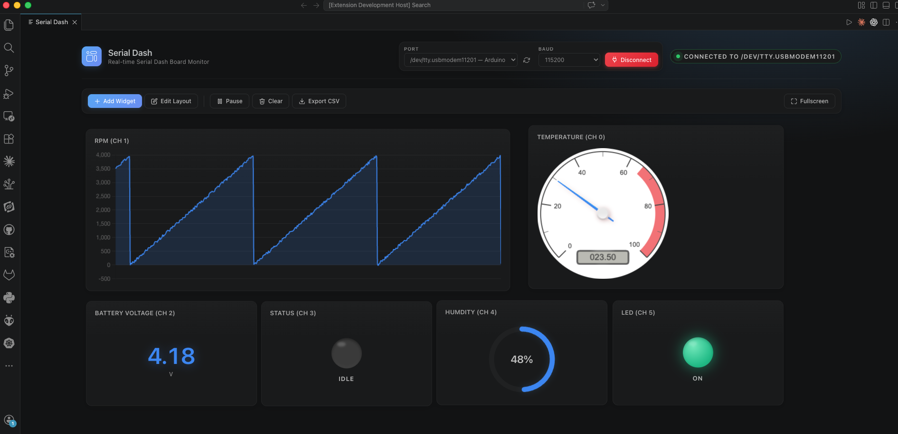

# Serial Dash

A modern, real-time serial-data dashboard for Visual Studio Code. Build live visualizations of microcontroller data (Arduino, ESP32, STM32, Raspberry Pi Pico, etc.) directly inside your editor — no external tools required.




## Features

- **Live serial monitor** with port + baud selection directly in the dashboard header
- **9 widget types**: line chart, radial gauge, simple gauge, horizontal bar, level bar, status LED, text note, value display, console
- **Per-widget customization**: title, channel, min/max range, units, decimals, accent color, and more
- **Rich text notes**: font size, color, alignment, bold/italic/underline, preset styles (Normal / Header / Code)
- **Drag-and-drop layout** with freeform positioning and resizing (powered by interact.js)
- **Fullscreen mode**: panel-only (hides dashboard chrome) or full VS Code (Zen Mode + OS fullscreen)
- **Pause / resume** data stream, **clear** history, **export** to CSV
- **Persistent state**: widgets, layout, and last-used port/baud survive reloads
- **Modern UI** using VS Code theme variables, with subtle shadows, gradients, and smooth animations

## Getting Started

### Usage

1. Open the command palette (`Cmd/Ctrl + Shift + P`)
2. Run **Serial Dash: Open Dashboard**
3. Select a **Port** and **Baud rate** in the header
4. Click **Connect**
5. Click **Add Widget** to create visualizations

### Serial Data Format

Send comma-separated values terminated by `\r\n`:
```
23.5,67.8,42.1
```
Each value is mapped to a channel index (`0`, `1`, `2`, …). Widgets subscribe to a specific channel.

Change the delimiter with **Serial Dash: Set Delimiter** (defaults to `,`).

Non-numeric characters are stripped, so prefixes like `T23.5` or `H67%` are also supported.

### Examples

Ready-to-flash sketches live in [`examples/`](./examples):

| Example | Description |
|---|---|
| [`dummy_serial`](./examples/dummy_serial/dummy_serial.ino) | Streams 6 simulated channels (temperature, RPM, battery, pressure, humidity, switch) at 20 Hz, 115200 baud — perfect for trying every widget type without real hardware. Tested on Arduino Uno / Nano / **UNO R4 Minima** / ESP32 / RP2040. |

Compile and upload with [arduino-cli](https://arduino.github.io/arduino-cli/):
```bash
# UNO R4 Minima
arduino-cli compile --fqbn arduino:renesas_uno:minima examples/dummy_serial
arduino-cli upload  --fqbn arduino:renesas_uno:minima -p <PORT> examples/dummy_serial
```

## Widget Types

Quick reference:

| Type | Use Case | Customizable |
|---|---|---|
| **Line Chart** | Time-series trends | Channel, title, color |
| **Radial Gauge** | Speedometer-style readout | Channel, range, units, color |
| **Simple Gauge** | Circular percentage ring | Channel, range, color |
| **Horizontal Bar** | Bounded level indicator | Channel, range, color |
| **Level Bar** | Fluid-like fill level | Channel, range, color |
| **Status LED** | Stoplight indicator (OK / Warning / Critical) | Channel |
| **Value Display** | Large numeric readout | Channel, units, decimals, color |
| **Console** | Raw serial log | Channel |
| **Text Note** | Annotations / headers | Font size, color, align, B/I/U, preset style |

---

### 📈 Line Chart

Plots a rolling time-series of the last 50 samples for one channel.

**How to use:**
1. Click **Add Widget** → select **Line Chart**.
2. Enter the **Channel** index that matches the field you're sending (e.g. `0` for the first value).
3. Optional: set a custom **Title** and pick an **Accent Color**.

**Example — Arduino temperature log (channel 0):**
```cpp
void loop() {
  float tempC = readTemp();
  Serial.println(tempC);   // single channel
  delay(500);
}
```

**Tip:** Use **Pause** in the toolbar to freeze the chart without losing incoming data; **Clear** wipes history across all widgets.

---

### ⏱ Radial Gauge

Speedometer-style analog gauge with min/max range, ticks, and a red warning zone in the top 20%.

**How to use:**
1. Add widget → **Radial Gauge**.
2. Set **Min** and **Max** to match your sensor range (e.g. `0` to `4095` for a 12-bit ADC).
3. Enter **Units** (e.g. `°C`, `RPM`, `V`) — these label the gauge face.

**Example — ESP32 pot reading (channel 1):**
```cpp
int adc = analogRead(34);    // 0–4095
Serial.print(tempC); Serial.print(",");
Serial.println(adc);         // channel 1
```
Configure the widget with Min=0, Max=4095, Units="ADC".

---

### ◯ Simple Gauge

Minimalist circular ring that fills from 0% to 100% of the range. Color shifts to amber above 60% and red above 80%.

**How to use:**
1. Add widget → **Simple Gauge**.
2. Set **Min** and **Max** (for example `0`–`100` for a percentage, or `0`–`1024` for a raw ADC).
3. Pick an **Accent Color** — used while the value is in the normal zone.

**Best for:** battery level, humidity, signal strength, fill level.

---

### ▬ Horizontal Bar

Bounded horizontal bar chart — like a level meter laid sideways.

**How to use:**
1. Add widget → **Horizontal Bar**.
2. Set **Min**/**Max** for the scale (e.g. `-50` to `50` for signed values).
3. Choose an **Accent Color**.

**Good for:** CPU load, memory usage, pressure, flow rate.

---

### ▤ Level Bar

A gradient-filled fluid-style bar with a percentage label below. Auto-shifts color: blue/accent → amber (>60%) → red (>80%).

**How to use:**
1. Add widget → **Level Bar**.
2. Set **Min** and **Max** so the % calculation is correct.
3. Choose an **Accent Color** for the base (non-warning) state.

**Best for:** tank level, fuel gauge, battery charge.

---

### ● Status LED

A stoplight-style indicator that maps numeric thresholds to colored states:

| Value | State | Color |
|---|---|---|
| `0` | OFF | Dark gray |
| `1 – 49` | OK | Green |
| `50 – 79` | WARNING | Yellow |
| `≥ 80` | CRITICAL | Red |

**How to use:**
1. Send a numeric severity code on the chosen channel.
2. Add widget → **Status LED** with the matching channel.

**Example — motor health:**
```cpp
int severity = 0;               // OFF
if (temp > 60) severity = 30;   // OK (running warm)
if (temp > 80) severity = 60;   // WARNING
if (temp > 100) severity = 90;  // CRITICAL
Serial.println(severity);
```

---

### # Value Display

A large, glowing numeric readout with optional units below. Honors a configurable decimal count.

**How to use:**
1. Add widget → **Value Display**.
2. Set **Decimals** (e.g. `2` for `23.45`, `0` for `23`).
3. Enter **Units** — shown below the number in uppercase.
4. Pick an **Accent Color** — tints the digits and their glow.

**Best for:** primary KPIs — voltage, current, temperature, RPM.

---

### ❯ Console

Displays raw incoming serial lines with timestamps. Doesn't parse or extract channels — it shows exactly what the device sent.

**How to use:**
1. Add widget → **Console**.
2. (Channel is ignored for this widget.)
3. Watch raw text scroll in; auto-scrolls to the latest line.

**Best for:** debugging, printf-style logs, mixed text + numeric output.

---

### ✎ Text Note

Freeform sticky-note for labels, headers, instructions, or section dividers. Does **not** receive serial data.

**How to use:**
1. Add widget → **Text Note**.
2. Pick a **Preset Style**: Normal / Header (large) / Code (monospace).
3. Tune **Font Size**, **Align**, **Text Color**, and **B / I / U** toggles.
4. Click into the note and type.
5. In **Edit Layout** mode the widget exposes an inline toolbar (B/I/U + size + color) for quick tweaks without opening the modal.

**Tip:** Text notes have no card background — use them to build labeled sections or titles across your dashboard.

---

## Typical Data Layouts

**Single-sensor stream** (one channel):
```
23.5
23.7
23.4
```
Use a Line Chart + Value Display, both on channel `0`.

**Multi-sensor stream** (comma-separated, default delimiter):
```
23.5,67.8,42.1,1
```
Pair widgets to channels:
- Line Chart ← channel 0 (temperature)
- Level Bar ← channel 1 (humidity)
- Simple Gauge ← channel 2 (pressure)
- Status LED ← channel 3 (fault code)

**Prefixed format** (non-numeric chars are stripped):
```
T23.5,H67.8,P42.1
```
Parses to `[23.5, 67.8, 42.1]`.

## Layout & Customization

- Click **Edit Layout** to enter edit mode — widgets gain drag + resize handles and a pencil (customize) + ✕ (remove) button.
- Click the pencil on any widget to open the customization modal with the widget's current settings pre-filled.
- Widget type is locked during edit to preserve data continuity.

## Fullscreen

| Action | Mode |
|---|---|
| Click **Fullscreen** | Panel-only (dashboard chrome hidden) |
| **Shift / Alt + Click** | Full VS Code (closes sidebar + panel, enters Zen Mode, OS fullscreen) |
| `F11` | Same as click |
| `Shift + F11` | Full VS Code mode |
| `Esc` | Exit fullscreen |

## Keyboard Shortcuts

| Key | Action |
|---|---|
| `Esc` | Close modal / exit fullscreen |
| `F11` | Toggle fullscreen (panel-only) |
| `Shift + F11` | Toggle fullscreen (full VS Code) |

## Data Export

Click **Export CSV** in the toolbar to download all captured data as `serial_data_<timestamp>.csv`. The export includes:
- `Timestamp` (ISO 8601)
- `Channel_0`, `Channel_1`, …
- `Raw` (original serial line)

## Commands

| Command | ID |
|---|---|
| Open Dashboard | `serialdash.openDashboard` |
| Set Delimiter | `serialdash.setDelimiter` |

## Requirements

- VS Code ^1.75.0
- Node.js 16+
- A serial device (or a USB–serial bridge like FTDI / CP210x / CH340)

## Dependencies

- [serialport](https://serialport.io/) — native serial I/O
- [Chart.js](https://www.chartjs.org/) — line + bar charts (CDN)
- [canvas-gauges](https://canvas-gauges.com/) — radial gauge (CDN)
- [interact.js](https://interactjs.io/) — drag + resize (CDN)

## Known Limitations

- Native `requestFullscreen` in webviews fills only the webview panel. Use **Shift+click** on the Fullscreen button for true VS Code–wide fullscreen.
- Port detection requires driver support for your USB–serial bridge.
- Data history is kept in memory (latest 50 points per line chart); full history persists only until the dashboard is closed.

## Credits

Created and maintained by ❤️ **Chatchai Buekban**  — [@ChatchaiBuekban](https://github.com/ChatchaiBuekban)

## License

Released under the [MIT License](LICENSE) — © 2026 Chatchai Buekban.
